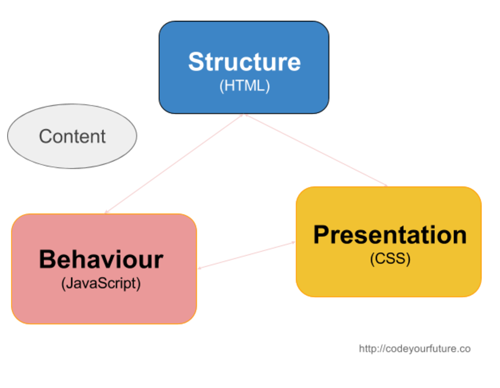

# Web Intro
**What will we learn today?**
- How the internet works?
- What are the different pieces of a website
- A bit of HTML/CSS

# Intro

We ask the stduents several intro questions (5 minutes or so)

1.  Who uses the internet? What do you use it for? What are you favorite websites?

2. What is the internet?

3. Who controls the internet?

4. What are their favorite websites? (we use those in the Game after)

# How the internet works?

> We can use the internet and we don't care how it works, like some people know how to drive a car without knowing how it works - but wouldn't it be cool if we can understand it better, and create the next Facebook?

Let's watch this video explaining the internet
[http://www.bbc.co.uk/guides/z3tbgk7](http://www.bbc.co.uk/guides/z3tbgk7)

- We write down the terms mentioned in the video

    - NETWORK
    - PROTOCOL (HTTP)
    - PACKETS
    - IP Address
    - DNS
    - ROUTER
    - Server
    - Client (Browser)
    - URI

*whenever a topic is covered in the next game, we cross it off the list*

## Game Time: Let's create the internet

Students take roles of the different pieces of the internet, adding a new piece every time.

### Round one - Simple

> we need one student to be the **server** (Facebook), someone will be the **browser**, one of the mentors is the **user**.

The user types a request for Facebook.com on the **browser** (on a paper), and hands it to the **router**, which goes to the **server** - the server returns the website content (a different paper) to the router, that takes it back to the browser, and hands it to the user.

### Round two - Protocols

> How do the browser, router and server talk to each other? How do they communicate? 

We simulate a situation where one of the mentors is the server, when the router asks for the page, the server responds in gibberish or a different language.

We tell them the importance of communicating in the same language - of having a **protocol** **HTTP**. (we play the game of two people from different cultures saluting each other? one bowing, one giving hand???)

### Round three - adding more servers

> We ask two more students to be servers (now, we have Google, Facebook and Wikipedia) - we don't tell them who is who.

We make a request to Google.com. The browser hands to the router, but then the router does not have a clue which of the students is Google.com.

We need an additional piece of the puzzle **The DNS** - it will have a table of the students' actual names (**IP addresses** for the **server**) and what websites they contain **the URI** (Google, FB etc..)

Now when we make a request, it goes and asks the **DNS** which points to the right server, which returns the response.

### Round four - packets

> what if the server returns a BIG website with loads of images and videos? We have to break our response into smaller pieces/packages. 

1. We let the router (it's not technically the router?) go back and forth, to get several messages that are part of the response. Maybe let Google and Facebook compete on who returns first.

2. Then we tell them, instead of having one message sent every time, we can send multiple messages with mulitple students that get gathered in the **router** - Who puts the messages in order again?

3. We simulate a packet being lost (interrupt one of the students, and steal their message) - what happens now? Explain that the protocol (the language that everyone understands) have ways of recovering that.

### ToDO:
- Artifacts: What do we need exactly? We need a piece of paper for the request, another for response (then multiple for breaking out a big response - maybe with different colors). We probably also some kind of labels on the students (Server, Client, Router etc...)

- Who does the message? it should not be the router going back and forth - we can have a role of a router's worker? basically a message carrier?

### Wrap up
We wrap up by explaining:
1. This is all a Network
2. The importance of having a common/simple language.
3. We show them all of that in the browser - in Chrome Devtools? and pinging Google.com to see the IP?

> This would lead us to the next step - what do the piece of paper contain? HTML, CSS and JS.

# Let's create a Web Page!